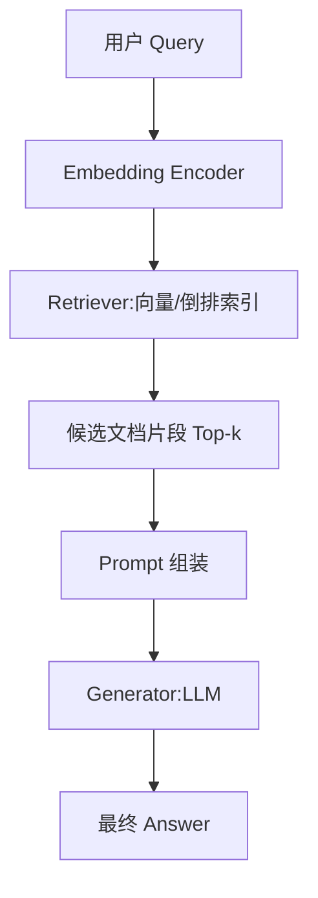

# 大模型知识问答RAG

## 一、RAG

> **RAG主要涉及企业内部的文档数据，如果需要一些插件功能，只能需要外部Function calling调用等操作；**

大模型缺点：知识不是实时的、不知道私有领域的业务知识。所有推出RAG：

- 向量检索原理：Faiss、HNSW、Annoy 等索引结构与召回流程
- 文档检索与检索增强生成（RAG）流程设计
- 知识图谱基础：实体、关系、三元组建模与存储（Graph Database）
- 混合问答系统：结构化（知识图谱）+ 非结构化（文档库）融合策略

---

### 1.1 什么是RAG？

Retrieval-Augmented Generation（检索增强生成，简称 RAG）将传统检索系统与生成式大模型结合：

1. **Retrieval（检索）**  
   - 从一个大规模知识源（文档库、知识图谱、数据库）中，找出与用户查询最相关的内容片段。  
   - 输出“事实依据”，确保生成内容有据可依。

2. **Augmented（增强）**  
   - 将检索到的内容作为“上下文”拼接到输入提示（Prompt）中，为生成模型提供额外信息。  
   - 上下文既可以是文档段落，也可以是知识图谱中的三元组或结构化数据。

3. **Generation（生成）**  
   - 将增强后的 Prompt 输入大型语言模型（LLM，如 GPT-4、Claude、ChatGLM）  
   - 由模型“理解并整合”检索上下文与自身预训练知识，生成最终回答。

---

#### 1.1.1 为什么要用 RAG？

- **解决大模型“幻觉”问题**：世界知识的纯生成模型有时会“凭空编造”事实，检索模块提供真实来源可校验。  
- **知识更新更灵活**：将知识存储在外部库，只需更新库即可，无需重新大规模微调 LLM。  
- **可解释性增强**：可在回答中附上检索文档编号或引用链接，方便业务审核与追溯。  

#### 1.1.2 简单流程

1. **Embedding Encoder**：将用户 Query 编码成向量（如 Sentence-transformer、MiniLM）。

2. **Retriever**：向量检索（FAISS、Milvus）或倒排索引检索（Elasticsearch/BM25）或者混合检索；Top-k 召回最相关文档或段落。

3. **Prompt 组装**：按预定义模板，将 Query 与检索段落拼接为 Prompt；可加入指令（role、格式、最大token数等）。

4. **Generator（LLM）**：将 Prompt 输入大模型，生成回答；可选择“streaming”模式实时输出。

5. **Answer 后处理**：过滤、去敏感、格式化（如 JSON、Markdown）；附上来源文档编号、引用链接。

---

#### 1.1.3 **RAG 在产品中典型应用**

- **智能客服**：结合企业内部文档、FAQ，实现高准确度自动问答
- **知识助手**：财经、医疗、法律等专业领域，保证回答有引用依据
- **文档摘要**：先检索相关章节，再生成综合摘要，提升摘要质量
- **教育辅导**：检索教材知识点，生成个性化学习指导

- **智能搜索**：第二代搜索模式
- **内容推荐**：根据用户画像进行精准推荐